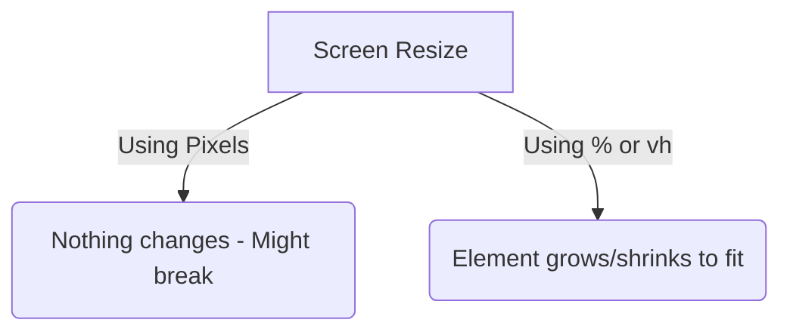

# CSS Units (Simplified)

## 1. The "Real World" Analogy
> **Concept:** Hard vs. Squishy.

- **`px` (Pixels) is like a BRICK.** 🧱
    Hard and fixed. It never changes size, no matter where you put it.


- **`em` is like a BABY DUCK.** 🦆
    It copies its **Mother** (the Parent element). If the Parent has big text, the `em` unit becomes big. If the Parent has small text, the `em` unit becomes small.


- **`rem` is like a STANDARD RULER.** 📏
    It always looks at one "Boss" (the Root HTML) to decide how big to be.


- **`%`, `vh`, `vw` are like a BALLOON.** 🎈
    Squishy. They expand or shrink to fit the room (screen) or box (parent) they are in.

---

## 2. The Explanation
**Why do we use `em` specifically?**
We use `em` for padding and margins inside components like **Buttons**. If you increase the font size of the button, the padding grows automatically to match it!

**How it works:**

- **`px` (Absolute):** Exact size.
    * `width: 200px` $\rightarrow$ Always 200 dots wide.

- **`em` (Parent EM):** Relative to the **Immediate Parent's Font Size**.
    * If Parent font is 20px, `1em` inside it = 20px.
    * If Parent font is 50px, `1em` inside it = 50px.

- **`rem` (Root EM):** Relative to the **HTML (Root)** tag.
    * If Root is 16px, `2rem` = 32px. (Stable and predictable).

- **`%` (Relative to Parent):** Depends on the container it is inside.

    * `width: 50%` $\rightarrow$ "Be half the size of the box I am sitting inside."
    
- **`vw` / `vh` (Relative to Screen):** Depends on the browser window.
    * `100vh` $\rightarrow$ "Be as tall as the screen."
    * `50vw` $\rightarrow$ "Be half as wide as the screen."

- **`rem` (For Text):** The smart way to size text.
    * `2rem` is usually roughly `32px`, but it respects user settings (good for accessibility).

---

## 3. Visual Logic


---

## 4. Code Example

Change the size of your browser window when running this. The "Brick" stays 200px. The "Balloon" changes.

```css
/* The Brick (Fixed) */
.box-pixel {
    width: 200px;       /* Always 200px */
    height: 200px;
    background-color: red;
}

/* The Balloon (Flexible) */
.box-percent {
    width: 50%;         /* Half the screen width */
    height: 50vh;       /* Half the screen height */
    background-color: blue;
}

/* The Text */
p {
    font-size: 2rem;    /* Big, readable text */
}
```

---

## 5. Common Pitfalls ⚠️

* **Mistake:** Using `height: 100%` when the parent has no height.

    - Fix: If the parent doesn't have a height, the child can't be `"100%"` of it. Use `100vh` if you want it to fill the screen.

- **Mistake:** Using `px` for main structural layouts. This makes your site look bad on mobile phones.

- **The `em` Trap (Compounding):** If you put an `em` inside an `em` inside another `em`, the size multiplies rapidly and gets huge.

    - *Advice:* Use `rem` for Font Size (to keep it stable). Use `em` for Padding/Margin (so spacing matches the text size).

---

## 6. Practice Tasks 🛠️

## Task 1: The "Squishy" vs. "Stiff" Box 📦
**Goal:** See the difference between fixed (`px`) and flexible (`%`) widths.

1.  **HTML:** Create two `div` elements.
    * Class 1: `.box-fixed`
    * Class 2: `.box-flex`
2.  **CSS (Shared):** Give both a `height` of `100px` and any background color.
3.  **CSS (Specific):**
    * `.box-fixed`: Set `width: 300px;`
    * `.box-flex`: Set `width: 50%;`
4.  **The Test:** Resize your browser window.
    * *Observation:* One stays the same size; the other grows and shrinks.

## Task 2: The "Hero" Section 🦸
**Goal:** Master the Viewport (`vh`/`vw`).

1.  **HTML:** Create a `div` with the class `.hero`.
2.  **CSS:**
    * Width: `100vw` (Full width of viewport)
    * Height: `100vh` (Full height of viewport)
    * Background: Choose a distinct color.
3.  **The Test:** The box should cover the **entire** visible screen on any device.

## Task 3: The Accessible Text 🧠
**Goal:** Understanding `rem` math.

1.  **CSS (Root):** Select `html` and set `font-size: 20px;`.
2.  **HTML:** Create a `<p>` tag with class `.intro-text`.
3.  **CSS (Text):** Set `.intro-text` font size to `3rem`.
4.  **The Test:** Calculate the final pixel size. (Hint: $3 \times 20 = ?$)
3. **Half-Width:** Create a green `div` that is always exactly half the width of the screen (`50vw`)

---

