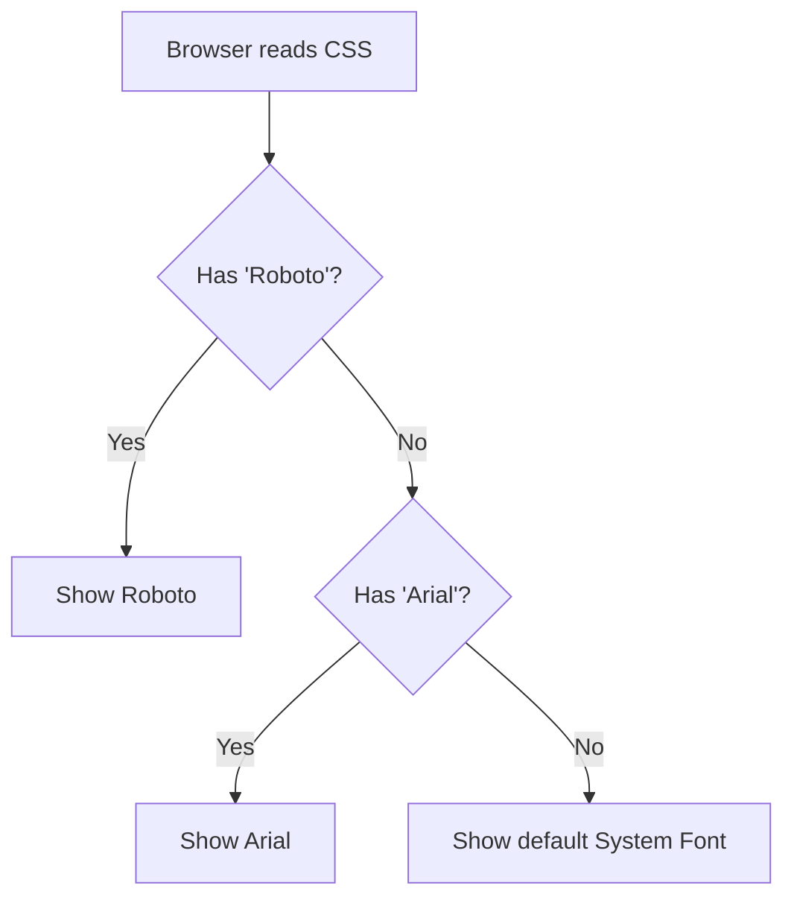

# CSS Fonts (Typography)

## 1. The "Real World" Analogy
> **Concept:** Handwriting & Backup Plans.

* **`font-family` (The Handwriting):** Imagine you ask a friend to write a letter. You ask for "Calligraphy." If they don't know Calligraphy, you ask for "Cursive." If they don't know that, you say "Just write clearly."

* **The "Fallback" Chain:** Browsers are the same. You give them a list of fonts. If they don't have the first one installed, they check the second, then the third.

---

## 2. The Explanation
**Why do we use this?**
To change the "vibe" of the text.

* **Serif:** Has "little feet" on the letters (like Times New Roman). Looks formal/traditional.

* **Sans-Serif:** No feet (like Arial). Looks modern/clean.

**Key Properties:**
1.  **`font-family`:** The list of fonts to use. Always end with a generic type (like `sans-serif`) just in case.

2.  **`font-weight`:** How thick the text is.
    * `normal` (400)
    * `bold` (700)

3.  **`font-style`:** Used mostly for `italic`.

4.  **`font-size`:** The height of the text. **(See new section below)**

---

## 2.5. Font Sizing (The Unit Rule) 📏
> **Concept:** The most critical typography rule is using **relative units**.

* **`font-size`:** Sets the height of the text.
* **The Golden Rule:** Always use **relative units** like `rem` (Root Em) or `em` (Parent Em).
* **Why?** Using `rem` ensures the text scales correctly if a user changes their base font settings for accessibility. Avoid using `px` for general text sizes.

---

## 3. Visual Logic (The Backup System)


---
## 4. Code Example

```css
/* 1. The Modern Look */
h1 {
    /* Sizing: Use REM for responsive sizing */
    font-size: 2.5rem; 
    /* Style: Try 'Roboto', if not there use 'Arial', if not use any clean font */
    font-family: "Roboto", "Arial", sans-serif;
    font-weight: bold; /* or 700 */
}

/* 2. The Fancy/Formal Look */
p {
    /* Sizing: Use a standard REM size for body text */
    font-size: 1rem; 
    /* Style: Times New Roman has spaces, so we use "quotes" */
    font-family: "Times New Roman", serif; 
    font-style: italic;
}
```

---

## 5. Common Pitfalls ⚠️

- `Mistake 1:` Forgetting the `generic fallback.`
    - **Bad:** `font-family: "MyCoolFont";` (If the user doesn't have this file, it breaks).

    - **Good:** `font-family: "MyCoolFont", sans-serif;`

- `Mistake 2:` Not using quotes for names with spaces.
    - **Bad:** `font-family: Times New Roman;`

    - **Good:** `font-family: "Times New Roman";`

---

## 6. Practice Tasks 🛠️

1. **The Modern Title:** Create an `h1` tag. Give it a `sans-serif` font (like Arial) and make it `bold`.

2. **The Classic Text:** Create a paragraph `<p>`. Give it a `serif` font (like Georgia) and make it `italic`.

3. **The Fallback Test:** Set a font family of `"FakeFontName", "Courier New", monospace.` Since "FakeFontName" doesn't exist, does your browser correctly show "Courier New"?